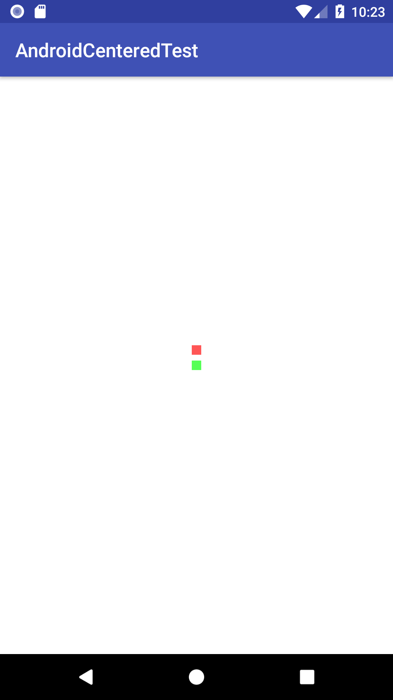

# AndroidCenteredTest

This is a test application looking at centering background and foreground elements. The goal is to make them line up, however the initial state shows them in different spots. The red box is created by the background in 'background.xml' and the green box is created by the foreground 'activity_main.xml'

